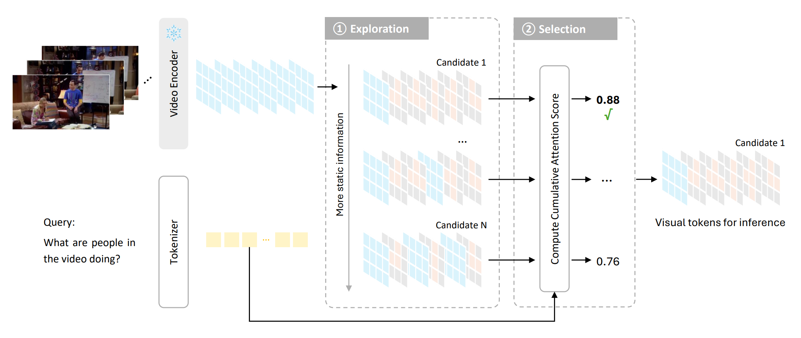

# Explore-Then-Select
Official implementation for **Static or Dynamic: Towards Query-Adaptive Token Selection for Video Question Answering (EMNLP 2025 Main)**. [[Paper]](https://arxiv.org/abs/2504.21403)

## Introduction

Video question answering benefits from the rich information available in videos, enabling a wide range of applications. However, the large volume of tokens generated from longer videos presents significant challenges to memory efficiency and model performance. To alleviate this issue, existing works propose to compress video inputs, but usually overlooking the varying importance of static and dynamic information across different queries, leading to inefficient token usage within limited budgets. To tackle this, we propose a novel token selection strategy, explore-then-select, that adaptively adjust static and dynamic information needed based on question requirements. Our framework first explores different token allocations between key frames, which preserve spatial details, and delta frames, which capture temporal changes. Next, it employs a query-aware attention-based metric to select the optimal token combination without model updates. Our proposed framework is plug-and-play that can be seamlessly integrated within diverse video-language models. Extensive experiments show that our method achieves significant performance improvements (up to 5.8\%) among various video question answering benchmarks.

## Repo Structure
```shell
.
├── model # modified model files
├── processor # modified processor files
├── scripts # running shell scripts
├── test # test python entries
└── utils # some datasets
```

## Environment Setup
You should first install LLaVA following the instruction in the repository (https://github.com/LLaVA-VL/LLaVA-NeXT.git). Then `pip install -r requirements.txt`. If you want to run Qwen2.5-VL, please refer to `requirements-qwen2.5-vl.txt`.

## Dataset Preparation
### VideoMME & EgoSchema & ActivityNet-QA & MLVU-Test
* VideoMME Link: https://huggingface.co/datasets/lmms-lab/Video-MME
* EgoSchema Link: https://huggingface.co/datasets/lmms-lab/egoschema
* ActivityNet-QA Link: https://huggingface.co/datasets/lmms-lab/ActivityNetQA
* MLVU-Test Link: https://huggingface.co/datasets/MLVU/MLVU_Test
* Clone the repository
* Download video zip files at Hugging Face
* Unzip all chunks into one folder

### MSVD-QA & MSRVTT-QA
* MSVD Link: https://www.cs.utexas.edu/users/ml/clamp/videoDescription/YouTubeClips.tar
* MSRVTT Link: https://www.mediafire.com/folder/h14iarbs62e7p/shared (test_videos.zip)
* Create the folder as follow
    ```
    msvd
    ├── txt
    └── video

    MSRVTT_QA
    ├── txt
    └── video
    ```
* Uncompressed the video files into corresponding video folders
* Move the groundtruth files to corresponding txt folders
    ```
    mv utils/msvd_test.jsonl /path/to/msvd/txt
    mv utils/msrvtt_test.jsonl /path/to/msrvtt/txt
    ```

## Path Configuration
Before running the code, you need to update the paths in several files to match your local environment:

1. All test scripts in the `test/` directory contain default path arguments that need to be modified:
   ```python
   parser.add_argument("--model", type=str, default="/path/to/dataset/Qwen2-VL-7B-Instruct")
   parser.add_argument("--dataset", type=str, default="/path/to/dataset/VideoMME")
   parser.add_argument("--video_path", type=str, default="/path/to/dataset/VideoMME/video")
   ```
   
2. Replace these paths with your actual paths where you've downloaded and stored:
   - The model files (e.g., Qwen2-VL-7B-Instruct, llava-onevision-qwen2-7b-ov)
   - The dataset folders (VideoMME, EgoSchema, MLVU, MSVD-QA, MSRVTT-QA, ActivityNet-QA)
   - The video folders within each dataset


## Code Running
### Test
After configuring all paths, you can run the test using:
```bash
python test/test_mme_qwen.py \
    --model /your/actual/path/to/Qwen2-VL-7B-Instruct \
    --dataset /your/actual/path/to/VideoMME \
    --video_path /your/actual/path/to/VideoMME/video
```

You can also modify and run the corresponding script in the scripts folder.

### Evaluate
Please check:
* test/evaluate_ego.py
* test/evaluate_mme.py
* test/evaluate_msvd.py
* test/evaluate_activitynet.py

## Acknowledgments
We would like to express our gratitude to the following excellent projects:
* [Qwen2.5-VL](https://github.com/QwenLM/Qwen2.5-VL): We added our plugin on the Qwen2-VL and Qwen2.5-VL models.
* [LLaVA-NeXT](https://github.com/LLaVA-VL/LLaVA-NeXT): We added our plugin on the LLaVA-OneVision model.
* [MovieChat](https://github.com/rese1f/MovieChat): We referred to its evaluation of open-ended questions.
* [ALPRO](https://github.com/salesforce/ALPRO): We referred to its preparation of MSVD-QA and MSRVTT-QA datasets.

We also sincerely thank the providers and curators of the datasets utilized in our project.

## Citation
```text
@article{shi2025static,
  title={Static or Dynamic: Towards Query-Adaptive Token Selection for Video Question Answering},
  author={Shi, Yumeng and Long, Quanyu and Wang, Wenya},
  journal={arXiv preprint arXiv:2504.21403},
  year={2025}
}
```